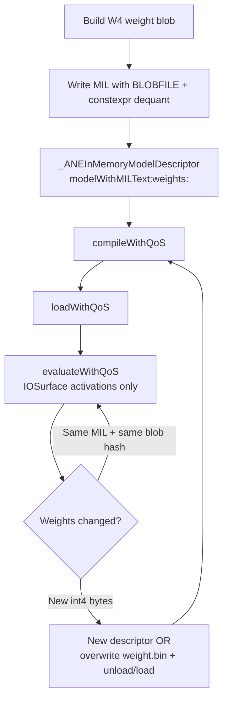

# Int4 Weights + MatMul on ANE (Private API Workflow)

This document describes how to run **fp16 MatMul on the Apple Neural Engine** with **int4 weight sources**, using the private `_ANEInMemoryModel` API and hand-written MIL. It summarizes probes in `test_matmul_int4.m`, `test_matmul_w_input.m`, `test_weightsbuffer_probe.m`, and patterns from Apple’s draft model (`adapter_training_toolkit` / `draft.mil`).

**Related code:** `test_matmul_int4.m`, `ds4_mlp_inmem_bench_int4.m`, `test_int4_tensor_buffer.m`, `ANE_API.md`, `_DSv4_MLP_ANE_Matmul_Investigation.md`.

---

## 1. Goal

Wire a linear layer as explicit MIL `matmul` on ANE while keeping weights in **int4** (or uint4 LUT) storage—not only as fp16 IOSurface uploads.

Typical shapes (DSv4 gate projection example):

| Tensor | Shape | Dtype |
|--------|-------|-------|
| `input` | `[batch, hidden]` | fp16 |
| `W` | `[hidden, interm]` | int4 in blob → fp16 at compile |
| `output` | `[1, batch, interm]` | fp16 |

---

## 2. High-level workflow



**Lifecycle (private API):**

1. **Descriptor** — UTF-8 MIL + `weights` dictionary (`@model_path/weights/weight.bin` → `{offset, data}`).
2. **Compile** — MIL → ANE microcode; `constexpr_*` folds int4 → fp16 into the compiled program.
3. **Load** — Upload program + baked weights to ANE.
4. **Evaluate** — Only **activation** IOSurfaces change per call (for the BLOBFILE path).

---

## 3. What works vs what does not (May 2026)

Probed on Apple Silicon via `test_matmul_int4.m` (`H=256`, `I=512`, `B=32`).

| ID | Weight source | MatMul `y` dtype | Compile | Eval |
|----|---------------|------------------|---------|------|
| **A** | `BLOBFILE` int4 → `constexpr_blockwise_shift_scale` → `squeeze` | fp16 | OK | OK (~0.26 ms/iter) |
| **E** | `BLOBFILE` uint4 → `constexpr_lut_to_dense` → `squeeze` | fp16 | OK | OK |
| **B** | Runtime `tensor<int4>` → `dequantize` | fp16 | FAIL (`CompilationFailure`) | — |
| **C** | Runtime `tensor_buffer<int4>` → `tensor_buffer_to_tensor` → `dequantize` | fp16 | FAIL (`InvalidMILProgram`) | — |
| **D** | Runtime `tensor<int4>` direct | int4 | FAIL (`InvalidMILProgram`) | — |

**Critical layout rule (variant A):** int4 weights must use the **4D conv layout** `[H, I, 1, 1]` with per-channel scale `[H, 1, 1, 1]` and offset `[H, 1, 1, 1]`, then `squeeze` axes `[2,3]` to `[H, I]` before `matmul`. A flat `[H, I]` `constexpr_blockwise_shift_scale` alone was rejected.

---

## 4. Compile once vs recompile when weights change

### Reuse compiled code (no recompile)

- **Same** MIL text, **same** weight `NSData` in the descriptor → `hexStringIdentifier` unchanged → disk cache (`compiledModelExists`) + same microcode.
- After `compile` + `load`, call `evaluateWithQoS:options:request:error:` repeatedly; only **input** IOSurfaces change.

### Recompile required

- **New** int4 weight bytes in the descriptor’s `weights:` dict → new `weightsHash` / `hexStringIdentifier` → call `compile` again (or create a new model).

### Does *not* avoid recompile for int4 BLOBFILE

- **`_ANERequest.weightsBuffer`** — for int4 `constexpr_blockwise_shift_scale` + BLOBFILE graphs, `test_weightsbuffer_probe.m` shows this IOSurface is **ignored**; descriptor weights are the only source.
- **Runtime int4 / `tensor_buffer<int4>` as MatMul weight** — does not compile on ANE in our tests.

### Optional: reload without full recompile

`training/test_weight_reload.m` demonstrates overwriting `weights/weight.bin` on disk, then `unload` + `load` (no `compile`) for **fp16** BLOBFILE conv. The same *may* apply to int4 blobs with identical chunk layout, but int4 MatMul + BLOBFILE has not been validated end-to-end for hot-swap.

### Alternative: fp16 weights as function inputs

`test_matmul_w_input.m` — `W` is a MIL function input; **no recompile** when weight values change; upload fp16 via IOSurface each eval (2× bandwidth vs int4).

---

## 5. W4 weight blob format

Chunked blob written to `@model_path/weights/weight.bin`:

```
[64-byte global header]  chunk_count @ byte 0, version @ byte 4
[64-byte chunk header]   magic EF BE AD DE, type @ byte 4
                           0x0B = int4 data, 0x01 = fp16 scale
[raw payload]
```

Example: three chunks for one layer — **data** (packed int4), **scale** (fp16 per output channel), **offset** (int4, often zeros).

```objc
// Chunk header (64 bytes) — from test_matmul_int4.m
static void writeChunkHeader(uint8_t *hdr, uint8_t type, uint32_t data_size) {
    memset(hdr, 0, 64);
    hdr[0]=0xEF; hdr[1]=0xBE; hdr[2]=0xAD; hdr[3]=0xDE;
    hdr[4]=type;  // 0x0B=int4, 0x01=fp16
    hdr[8]  = (uint8_t)(data_size & 0xFF);
    hdr[9]  = (uint8_t)((data_size >> 8) & 0xFF);
    hdr[10] = (uint8_t)((data_size >> 16) & 0xFF);
    hdr[11] = (uint8_t)((data_size >> 24) & 0xFF);
}
```

`BLOBFILE(..., offset = uint64(N))` must point at the **chunk header** offset, not the raw payload.

---

## 6. Sample MIL — variant A (recommended)

**Pattern:** int4 BLOBFILE → blockwise dequant → 4D → squeeze → fp16 matmul (`transpose_x=true`, `transpose_y=false`).

Shapes: `hidden=H`, `interm=I`, `batch=B`.

```mil
program(1.3)
[buildInfo = dict<string, string>({
    {"coremlc-component-MIL", "3520.4.1"},
    {"coremlc-version", "3520.5.1"},
    {"coremltools-component-milinternal", ""},
    {"coremltools-version", "9.0"}
})]
{
    func main<ios18>(tensor<fp16, [B, H]> input) {
        // --- int4 weights: compile-time dequant (offsets = chunk headers in weight.bin) ---
        tensor<fp16, [H, I, 1, 1]> W4 = constexpr_blockwise_shift_scale(
            data = tensor<int4, [H, I, 1, 1]>(
                BLOBFILE(path = string("@model_path/weights/weight.bin"), offset = uint64(DATA_OFF))),
            offset = tensor<int4, [H, 1, 1, 1]>(
                BLOBFILE(path = string("@model_path/weights/weight.bin"), offset = uint64(OFFSET_OFF))),
            scale = tensor<fp16, [H, 1, 1, 1]>(
                BLOBFILE(path = string("@model_path/weights/weight.bin"), offset = uint64(SCALE_OFF))));

        tensor<int32, [2]> sq_wi = const()[val = tensor<int32, [2]>([2, 3])];
        tensor<fp16, [H, I]> W_fp16 = squeeze(axes = sq_wi, x = W4);

        // --- activation layout for ANE matmul ---
        tensor<int32, [2]> perm0 = const()[val = tensor<int32, [2]>([1, 0])];
        tensor<int32, [1]> ax0  = const()[val = tensor<int32, [1]>([0])];
        bool tx_t = const()[val = bool(true)];
        bool tx_f = const()[val = bool(false)];

        tensor<fp16, [H, B]> in_t = transpose(perm = perm0, x = input);
        tensor<fp16, [1, H, B]> x_3d = expand_dims(axes = ax0, x = in_t);
        tensor<fp16, [1, B, I]> output = matmul(
            transpose_x = tx_t, transpose_y = tx_f, x = x_3d, y = W_fp16);
    } -> (output);
}
```

Replace `B`, `H`, `I`, `DATA_OFF`, `SCALE_OFF`, `OFFSET_OFF` with integers.

---

## 7. Sample MIL — variant E (draft LUT style)

Apple draft models use **uint4 indices + fp16 LUT** (`constexpr_lut_to_dense`), then conv—not raw int4 matmul. The same LUT path **does** compile for matmul after squeeze:

```mil
        tensor<fp16, [H, I, 1, 1]> W4 = constexpr_lut_to_dense(
            indices = tensor<uint4, [H, I, 1, 1]>(
                BLOBFILE(path = string("@model_path/weights/weight.bin"), offset = uint64(IDX_OFF))),
            lut = tensor<fp16, [H, 1, 1, 1, 16, 1]>(
                BLOBFILE(path = string("@model_path/weights/weight.bin"), offset = uint64(LUT_OFF))));

        tensor<fp16, [H, I]> W_fp16 = squeeze(
            axes = const()[val = tensor<int32, [2]>([2, 3])], x = W4);
        // ... same matmul tail as variant A ...
```

---

## 8. Sample Objective-C — private API end-to-end

Minimal flow matching `test_matmul_int4.m` / `ANE_API.md`:

```objc
#import <Foundation/Foundation.h>
#import <objc/message.h>
#import <dlfcn.h>
#import <IOSurface/IOSurface.h>

// 1) Load ANE framework
dlopen("/System/Library/PrivateFrameworks/AppleNeuralEngine.framework/AppleNeuralEngine", RTLD_NOW);

Class DescCls = NSClassFromString(@"_ANEInMemoryModelDescriptor");
Class ModelCls = NSClassFromString(@"_ANEInMemoryModel");
Class ReqCls   = NSClassFromString(@"_ANERequest");
Class SurfCls  = NSClassFromString(@"_ANEIOSurfaceObject");

// 2) MIL + weight blob (built offline; see §5)
NSString *mil = /* genMIL_blobShift(H, I, B, data_off, scale_off, offset_off) */;
NSData *milData = [mil dataUsingEncoding:NSUTF8StringEncoding];
NSData *weightBlob = /* buildW4Blob(H, I, ...) */;

NSDictionary *weights = @{
    @"@model_path/weights/weight.bin": @{
        @"offset": @0,
        @"data": weightBlob
    }
};

// 3) Descriptor + model
id desc = ((id(*)(Class, SEL, id, id, id))objc_msgSend)(
    DescCls, @selector(modelWithMILText:weights:optionsPlist:),
    milData, weights, nil);

id model = ((id(*)(Class, SEL, id))objc_msgSend)(
    ModelCls, @selector(inMemoryModelWithDescriptor:), desc);

// 4) Persist MIL/weights under tmp (compiler reads this tree)
id hx = ((id(*)(id, SEL))objc_msgSend)(model, @selector(hexStringIdentifier));
NSString *tmpDir = [NSTemporaryDirectory() stringByAppendingPathComponent:hx];
// ... write model.mil and weights/weight.bin ...

NSError *err = nil;
unsigned qos = 21;

BOOL ok = ((BOOL(*)(id, SEL, unsigned int, id, NSError**))objc_msgSend)(
    model, @selector(compileWithQoS:options:error:), qos, @{}, &err);
// ok == YES → compiled; same MIL+weights → cache hit on next run

ok = ((BOOL(*)(id, SEL, unsigned int, id, NSError**))objc_msgSend)(
    model, @selector(loadWithQoS:options:error:), qos, @{}, &err);

// 5) IOSurface I/O — activations only for BLOBFILE path
int B = 32, H = 256, I = 512;
NSUInteger inBytes  = (NSUInteger)B * H * 2;  // fp16
NSUInteger outBytes = (NSUInteger)B * I * 2;

IOSurfaceRef ioIn = IOSurfaceCreate((__bridge CFDictionaryRef)@{
    (id)kIOSurfaceWidth: @(inBytes),
    (id)kIOSurfaceHeight: @1,
    (id)kIOSurfaceBytesPerElement: @1,
    (id)kIOSurfaceBytesPerRow: @(inBytes),
    (id)kIOSurfaceAllocSize: @(inBytes),
    (id)kIOSurfacePixelFormat: @0
});
IOSurfaceRef ioOut = /* same layout, outBytes */;

id surfIn  = ((id(*)(Class, SEL, IOSurfaceRef))objc_msgSend)(
    SurfCls, @selector(objectWithIOSurface:), ioIn);
id surfOut = ((id(*)(Class, SEL, IOSurfaceRef))objc_msgSend)(
    SurfCls, @selector(objectWithIOSurface:), ioOut);

// Fill ioIn with fp16 activations ...

id request = ((id(*)(Class, SEL, id, id, id, id, id, id, id))objc_msgSend)(
    ReqCls,
    @selector(requestWithInputs:inputIndices:outputs:outputIndices:
              weightsBuffer:perfStats:procedureIndex:),
    @[surfIn], @[@0], @[surfOut], @[@0],
    nil,   // weightsBuffer: nil for BLOBFILE int4 (ignored if set)
    nil, @0);

// 6) Inference loop — reuse compiled program
for (int i = 0; i < numIters; i++) {
    ((BOOL(*)(id, SEL, unsigned int, id, id, NSError**))objc_msgSend)(
        model, @selector(evaluateWithQoS:options:request:error:),
        qos, @{}, request, &err);
}

((BOOL(*)(id, SEL, unsigned int, NSError**))objc_msgSend)(
    model, @selector(unloadWithQoS:error:), qos, &err);
```

---

## 9. Build and run the probe harness

```bash
cd /path/to/ANE

xcrun clang -fobjc-arc -O2 -Wall \
    -framework Foundation -framework IOSurface -ldl \
    -o test_matmul_int4 test_matmul_int4.m

# All variants
./test_matmul_int4 --H 256 --I 512 --B 32

# Single variant: 1=A, 2=B, 3=C, 4=D, 5=E
./test_matmul_int4 --test 1

# Dump generated MIL
./test_matmul_int4 --test 1 -v
```

---

## 10. Relation to `draft.mil` (`tensor_buffer<int4>`)

Apple’s draft model uses:

```mil
tensor_buffer<int4, shape=[153600, 1, 256], strides=[2048, 2048, 8],
    interleave_factors=[8, 1, 1]> in_embeddings
```

That buffer is for **embedding tables** (gather + dequant + fp16 ops), not as the `y` operand of `matmul`. Projection weights in draft use **`constexpr_lut_to_dense`** (uint4) → **conv**.

| Draft pattern | MatMul on ANE? |
|---------------|----------------|
| `tensor_buffer<int4>` embeddings → gather → dequant | Input-side; separate from W |
| `constexpr_lut_to_dense` → conv | Yes (conv); LUT + squeeze also works → matmul (variant E) |
| int4 as `matmul` weight without constexpr | No (variants B/C/D fail) |

---

## 11. Decision guide

| Requirement | Recommended path |
|-------------|------------------|
| Smallest weight storage, fixed checkpoint | **Variant A** — BLOBFILE int4 + `constexpr_blockwise_shift_scale` + matmul |
| Draft-compatible LUT weights | **Variant E** — `constexpr_lut_to_dense` + matmul |
| Change weights every step without recompile | **fp16 W input** — `test_matmul_w_input.m` (not int4) |
| Stream int4 weights per inference into matmul | **Not available** on ANE via tested private API |
| Training with updated int4 each step | New descriptor / recompile (or experimental unload+reload blob) |

---

## 12. References in this repo

| File | Purpose |
|------|---------|
| `test_matmul_int4.m` | All int4 + matmul variants (A–E) |
| `test_matmul_w_input.m` | fp16 W-as-input matmul (runtime weight swap) |
| `test_weightsbuffer_probe.m` | Proves `weightsBuffer` ignored for BLOBFILE int4 |
| `test_int4_tensor_buffer.m` | int4 / tensor_buffer / conv / embedding probes |
| `ds4_mlp_inmem_bench_int4.m` | Full W4A8 MLP via conv1x1 + BLOBFILE |
| `training/test_weight_reload.m` | Overwrite `weight.bin` + unload/load |
| `ANE_API.md` | Private class/method reference |
| `_DSv4_MLP_ANE_Matmul_Investigation.md` | Broader matmul + streamed-weight investigation |

---

*Last updated from ANE probes, May 2026.*

---

## 13. MXFP4 (DSv4-Flash original experts) → ANE viability — 2026-05-20

The original `/Volumes/TB36/Models/DS/DeepSeek-V4-Flash/` model stores experts
as **MXFP4 (OCP Microscaling FP4)**: each `I8` byte packs two FP4 (e2m1)
values, paired with `F8_E8M0` (8-bit exponent-only) per-block scales over
32-element blocks along the input axis. Confirmed by reading the safetensors
header and decoding (`fp4_samples/decode_mxfp4.py`):

- `w1.weight` dtype=`I8`, shape `[mid, hidden/2]` (2 fp4 per byte)
- `w1.scale` dtype=`F8_E8M0`, shape `[mid, hidden/32]` (one scale per 32 fp4)
- Per-tensor scale distribution: 99.97% within 1 exponent-bit of median for a sampled expert

### 13.1 ANE-placement constraint (verified)

`anemll-profile` of compiled-OK `constexpr_blockwise_shift_scale + (matmul|conv1x1)`
programs at `H=4096 I=2048 B=64`:

| Variant | ANE ops | CPU ops | Fallback reason |
|---|---|---|---|
| matmul + per-channel scale `[H, 1]` | **1** | 0 | — |
| matmul + per-32-block scale `[H, I/32]` | 0 | **1** | `ane: ANE only support per-cout/per-tensor quantization` |
| **conv1x1** + per-channel scale | **1** | 0 | — |
| **conv1x1** + per-32-block scale | 0 | **1** | **same error** as matmul |

**Conclusion:** The per-channel-or-per-tensor restriction is a property of
the **ANE compiler's quant placement**, not the matmul vs conv op. Conv2d
does **not** offer a way around it. To run MXFP4 on ANE, weights must be
**re-quantized into per-channel int4 + per-channel fp16 scale**.

### 13.2 MXFP4 → per-channel int4 precision loss (verified)

Re-quantizer: `fp4_samples/requant_to_perchannel.py`. Per-row symmetric
quantization, scale = max(|row|)/7, weights clipped to [-8, 7].

Sampled from layer-0 experts 0–3 of DSv4-Flash (12 matrices total):

| Metric | Range |
|---|---|
| Weight max relative error | 7.13% (one FP4 step at peak; constant) |
| Weight RMS relative error | 2.3-3.5% |
| **Matmul output RMS relative error** (synthetic activation) | **3.3-4.5%** |

This sits well inside the ~5-10% tolerance that the existing int4 ANE paths
(variant A/E in §3-7) operate at. Per-channel re-quantization of MXFP4 is
numerically acceptable for inference.

### 13.3 Storage and bandwidth implications

| Format | Bytes per expert (gate+up+down, H=4096 I=2048) |
|---|---|
| Original MXFP4 on disk | ~6.0 MiB (weights) + ~0.75 MiB (scales) ≈ 6.8 MiB |
| Current `iq2_xxs/q2_k` GGUF re-pack | ~6 MiB (similar 2-bit storage) |
| Current `int8` ANE upload (after GPU dequant) | **24 MiB per ANE call** |
| Per-channel int4 baked into ANE program | **12 MiB** (50% less than int8) + scales (~12 KiB) |

If MXFP4 expert weights are baked into per-expert ANE programs (one
compiled `_ANEInMemoryModel` per expert), the GPU dequant kernel goes
away **entirely** and the per-ANE-call CPU→ANE IOSurface upload disappears
(weights are pre-loaded once per program). Per the per-call cost
decomposition in `DSv4_MLP_ANE_Matmul_Investigation.md` Appendix C.2,
weight upload is currently ~24% of per-ANE-call wall (~0.39 ms of 1.65 ms).
Eliminating it caps the per-call wall at ~1.27 ms, a 23% improvement.

### 13.4 ANE program switch cost (measured 2026-05-20)

Probe: `test_int4_unload_load_latency.m`. Compiles one int4 + per-channel
scale + conv1x1 at gate-matrix shape (H=4096 I=2048 B=512), then loops
`unloadWithQoS` + `loadWithQoS` + `evaluateWithQoS` for 50 iterations.

| Phase | p50 | Notes |
|---|---|---|
| Compile (cold, one-time) | 24.4 ms | Cached to disk by hexStringIdentifier |
| First load (cold) | 15.8 ms | Cached on subsequent loads |
| **Steady-state evaluate (no switch)** | **0.526 ms** | **3.1× faster than current int8 path's 1.65 ms** |
| Unload | 0.189 ms | Fast |
| Load (after first) | 1.99 ms | **Bottleneck of the switch** |
| **Per-call switch (unload+load)** | **2.14 ms** | Exceeds eval by 4.4× at B=512, 18× at B=64 |

**Verdict for the naïve "switch per ANE call" scheme: FAIL.** The 2.14 ms
switch cost exceeds the current per-call wall (1.65 ms), so swapping
expert programs on every call costs more than it saves.

### 13.5 ANE multi-program co-residency (measured 2026-05-20)

The follow-up question: **can N distinct compiled programs stay loaded
simultaneously so we just `evaluate` the right one without unload+load?**
Probe: `test_int4_multi_loaded.m`. Compiles + loads N distinct int4
conv1x1 programs (different weight blobs → different
`hexStringIdentifier`), then rotates `evaluate` across all N.

| N (slots) | Total weight bytes | Rotation eval p50 | vs single-loaded |
|---|---|---|---|
| 4 | 16 MiB | 0.529 ms | identical |
| 8 | 32 MiB | 0.530 ms | identical |
| 16 | 64 MiB | 0.539 ms | +2% |
| 32 | 128 MiB | 0.539 ms | +2% |
| 64 | 256 MiB | 0.554 ms | +5% |
| 128 | 512 MiB | 0.578 ms | +10% |
| **237** | **~950 MiB** | **(passes)** | |
| **238** | — | **FAIL: `createProgramInstanceForModel:… Program load failure (0x50004)`** | |

**The ANE driver supports up to ~237 concurrent loaded int4 programs at
this size with negligible switch overhead.** This is the key enabler.
First load is 16 ms cold; subsequent loads are ~2 ms each; unload is
~0.18 ms. Once loaded, picking which of the 237 to `evaluate` is free.

### 13.6 Implications for production MoE on DSv4-Flash

With the multi-loaded primitive proven, the per-expert pre-compiled
program plan becomes viable IN PRINCIPLE, but the architecture has to
respect the 237-program ceiling per moment.

- 256 experts × 43 layers = **11,008 unique (expert, layer) programs**
  to cover the full DSv4-Flash MoE.
- 237 co-residency limit ⇒ cannot hold all 11k loaded at once
  (would need ~44 GiB of program memory anyway).
- 256 experts of ONE layer = 256 programs, slightly above the 237
  limit — but 99th-percentile routing usually concentrates in ~80%
  of experts per layer (Zipfian), so the top-237 per layer would
  cover near-all tokens with GPU fp32 fallback for the rest.

**Important refinement: the current sidecar dedup+overlap mechanism
already loads only what's needed, with latency hidden behind compute.**
For prefills > 4K tokens this reduces effective load volume by 70-90%
vs the naive "load all per layer" upper bound. Applied to ANE programs:

- Measured dedup at 8K prefill: `dedup refs=2,173,134 unique=18,788
  reuse=115.7×` (Phase-1 stats). Per-layer unique = ~437 (expert,layer)
  pairs, but the per-chunk working set is a fraction of that.
- The existing scheduler already prefetches the next expert's weights
  while the current ANE/GPU work is in flight (see
  `metal_graph_flash_moe_stage_prefill_expert` and the prefetch knob).
- A symmetric ANE-side mechanism would: schedule `loadWithQoS` on
  expert E+1's compiled program while ANE evaluate is running on E,
  honoring the 237-ceiling LRU.

Viable production designs ordered by integration cost:

1. **Persistent-loaded across requests (best fit for long-running
   servers).** Compile all 11k programs once at startup (~3 minutes,
   disk-cached thereafter). Keep the most-frequently-routed programs
   warm. Per ANE call is then steady-state 0.53 ms — **3.1× faster
   than current int8 path** — with no per-call switch overhead.
   Combined throughput could exceed GPU-only (~199 t/s) for the
   second-and-onward request.

2. **Sidecar-style streaming with overlapped load (best fit for
   one-shot prefill).** Reuse the existing prefetch infrastructure but
   for ANE programs:
     - Plan: scheduler decides per-chunk which (expert, layer) ANE
       programs are needed (typically 10-30% of the 11k total for an
       8K prefill, per the dedup ratio).
     - Stage: while ANE evaluates expert E, async-issue
       `loadWithQoS` for expert E+1 (compile is already cached, only
       load is ~2 ms warm).
     - Evict: LRU drops programs past the ~237 ceiling.
     - The latency-hiding pattern mirrors the GPU dedup sidecar that
       already wins 70-90% of "naive" load cost — exposed load tax
       drops from ~20 s naive to ~2-5 s effective, potentially
       hideable behind the 5-7 s of ANE eval work per prefill.

3. **Hybrid: persistent + sidecar.** Top-K most-frequent (expert, layer)
   programs are persistent in the 237 budget across requests; the
   long-tail loads on demand with overlap. Best of both for a server
   that handles diverse prompts.

The path forward that genuinely closes the GPU-only gap is **#2** for
this repo's prefill benchmarks (where the sidecar mechanism is the
right architectural match), and **#3** for production servers.

Production integration would require:
  (a) Offline tool: convert DSv4-Flash MXFP4 → per-channel int4 +
      11k compiled `.mlmodelc` cache (one-time per model).
  (b) Runtime: lazy-load + LRU eviction of ANE programs respecting
      the 237 ceiling per signature.
  (c) Async overlap: extend the existing prefetch scheduler to also
      schedule ANE program loads (the existing GPU dedup sidecar
      already proves 70-90% latency hiding for >4K prefill).
  (d) Dispatch: route per-token to ANE if expert is loaded, fall back
      to GPU fp32 otherwise — preserving the current correctness path
      for cache-miss experts.

For one-shot prefill benchmarks the current default combined mode
(~187 t/s) is still a fair baseline; the multi-loaded breakthrough
opens a real path to beat it, but the integration is non-trivial and
should be measured against the current sidecar overlap behavior to
quantify the achievable speedup.

### 13.7 ANE compute mode matters: fp16 vs int8 (2026-05-20 follow-up)

Earlier in §13.4 the 0.53 ms steady-state was measured at the **FP16
compute** mode — `constexpr_blockwise_shift_scale` dequants int4 → fp16
at compile time, then conv1x1 runs FP16 × FP16. To verify whether ANE's
int8 systolic is faster, probed both compute modes at the same shape:

| Compute mode | Probe | p50 eval | Program bytes (weights only) |
|---|---|---|---|
| **FP16 compute** (int4 BLOBFILE → fp16 const → fp16 conv) | `test_int4_unload_load_latency.m` | **0.526 ms** | 4 MiB int4 |
| **int8 compute** (int8 BLOBFILE → fp16 const + activation quant/dequant hint → int8 GEMM) | `test_int8_compute_latency.m` | **0.321 ms** | 8 MiB int8 |
| int4 storage + int8-compute hint chain (constexpr_blockwise_shift_scale → quantize → dequantize) | `test_int4store_int8compute.m` | **9.337 ms** ❌ | n/a (runtime mat'lized) |
| Current production int8 path (per-call upload) | (in ds4) | 1.65 ms | streamed |

**Key findings:**

1. **int8 compute is 1.64× faster than FP16 compute** on M5 ANE for this
   shape (0.321 vs 0.526 ms). The activation `quantize → dequantize` hint
   immediately before the conv triggers the ANE int8 systolic, as the
   compiled MIL contains `int8` ops with the `constexpr_affine_dequantize`
   weight const pattern from `ds4_mlp_inmem_bench_int8.m`.

2. **Co-residency ceiling is program-count, NOT bytes.** At int8 the
   probe `test_int8_multi_loaded.m` hits the SAME N≈238 ceiling at
   ~1.9 GiB co-resident, vs N≈237 at ~950 MiB for int4. So doubling
   program size only doubles memory pressure; the program-slot count
   is the hard limit either way.

3. **The "int4 storage + int8 compute" combo path doesn't work.** The
   chain `constexpr_blockwise_shift_scale → quantize → dequantize` is
   **not const-folded** by the CoreML/ANE compiler. Confirmed by
   inspecting the compiled MIL: it's byte-for-byte identical to the
   input, with the int8-quantize-on-weights running at runtime.
   Per-eval cost balloons to 9.34 ms (likely CPU fallback or live
   fp16 weight materialization at 16 MiB/call). So the optimization
   "keep int4 footprint AND get int8 speed" via runtime constexpr
   chaining is not viable.

4. **The viable "small + fast" path is OFFLINE re-quantization.** Take
   MXFP4 weights → fp16 reference (`decode_mxfp4.py`) → per-channel
   int8 + per-channel fp16 scale (small Python extension of
   `requant_to_perchannel.py` to emit int8 instead of int4). Bake the
   int8 result into the ANE program. Result: 8 MiB program with
   0.32 ms int8 compute eval. **The "DELUT" must happen at the
   conversion tool, not in the MIL graph.**

### 13.8 Updated production path picture

For the DSv4-Flash MoE on M5 Max:

| Path | Per-call eval | Per-program size | 237 ceiling fits |
|---|---|---|---|
| Status quo (int8 upload, MPP GPU dequant) | 1.65 ms | 0 (streamed) | ∞ |
| Per-expert ANE int4 fp16-compute | 0.53 ms | 4 MiB | 237 programs (~92% of 256 experts) |
| **Per-expert ANE int8 int8-compute** | **0.32 ms** | 8 MiB | 237 programs (~92% of 256 experts) |

Both the int4 and int8 baked variants comfortably fit 237 experts
per signature. The int8 version is **3.1× faster per eval (vs FP16) →
5.1× faster than the current production int8-upload path** at the same
shape. The 8 MiB-vs-4 MiB program size only differs in unified-memory
usage (~950 MiB vs ~1.9 GiB co-resident at full N=237) — both are
within M5 Max's 128 GiB headroom.

Combined with §13.6's sidecar-style overlapped loading (which already
hides 70-90% of weight-load latency in the current GPU dedup path) and
applied to int8-baked ANE programs, the production architecture is:

- Offline: decode DSv4-Flash MXFP4 → per-channel int8 + scale per
  (expert, layer) → compile each into one `.mlmodelc`.
- Runtime: scheduler keeps the hottest ~237 (expert, layer) programs
  loaded per signature, evicts via LRU. `loadWithQoS` for the next
  expert overlaps with `evaluateWithQoS` on the current one.

### 13.9 Files added 2026-05-20

| File | Purpose |
|---|---|
| `fp4_samples/decode_mxfp4.py` | Decode MXFP4 → fp16 reference (e2m1 + F8_E8M0 codec) |
| `fp4_samples/requant_to_perchannel.py` | MXFP4 → per-channel int4 + fp16 scale; measure precision loss |
| `fp4_samples/probe_coreml_mxfp4_matmul.py` | Verify CoreML compiles per-channel + per-block matmul variants |
| `fp4_samples/probe_coreml_mxfp4_conv2d.py` | Same probe via conv1x1; confirms ANE placement constraint is op-agnostic |
| `fp4_samples/layer0_experts_0to3/` | 4 experts × 3 matrices × 2 dtypes (51 MiB) raw safetensors slices |
| `fp4_samples/layer0_experts_0to3/decoded/` | fp16 references + int4-packed + per-block fp16 scales |
| `fp4_samples/layer0_experts_0to3/perchannel/` | ANE-compatible per-channel int4 + per-channel fp16 scales |
| ANE repo: `test_int4_unload_load_latency.m` | Measure ANE program switch (unload+load) latency for int4 + per-channel BLOBFILE |
| ANE repo: `test_int4_multi_loaded.m` | Probe N-program co-residency limit — established N≈237 at 4 MiB each |
| ANE repo: `test_int8_compute_latency.m` | int8-compute eval latency probe (0.321 ms p50 at H=4096 I=2048 B=512) |
| ANE repo: `test_int8_multi_loaded.m` | int8 N-program co-residency probe — N≈238 at 8 MiB each (~1.9 GiB) |
| ANE repo: `test_int4store_int8compute.m` | Probe constexpr int4→fp16→int8 chain — confirmed NOT const-folded (9.3 ms runtime cost) |
| ANE repo: `test_lut_dtype_probe.m` | Probe `constexpr_lut_to_dense` lut dtype acceptance on ANE: int8 LUT is rejected by MIL validator (InvalidMILProgram); uint8 LUT + `dequantize` is accepted |
| ANE repo: `test_lut_int8_compute.m` | Probe int4-LUT-stored + int8-compute fusion: uint8 LUT → dequantize → conv + activation hint. NOT folded — eval ran live at **10.27 ms p50** (~32× slower than int8-storage baseline) |

### 13.11 PoC — int4-fp16 numerical correctness on real DSv4 expert (2026-05-20)

End-to-end correctness check using expert 0, w1 (gate proj, shape
[intermediate=2048, hidden=4096]) from `layer0_experts_0to3/`,
re-quantized via `requant_to_perchannel.py` (per-channel int4 + per-row
fp16 scale), B=64 fp16 inputs.

Path: `coremltools.mb.constexpr_blockwise_shift_scale(data=int4,
scale=fp16) → matmul` compiled to mlprogram, `compute_units=CPU_AND_NE`.

| Comparison | RMS / max\|y_ref\| |
|---|---|
| per-channel dequant vs fp16 reference (no ANE) | 3.6793% |
| ANE result vs per-channel dequant reference    | **0.0070%** |
| ANE result vs fp16 reference (total error)     | 3.6795% |

ANE-only noise on top of the quant error is **0.01%** — i.e., the ANE
int4-fp16 compute path is numerically faithful to a CPU dequantize-then-
matmul reference. All the error is offline re-quantization; ANE adds
none. The 3.68% quant error matches the §13.2 prediction band.

Steady-state Python `predict()` 0.6 ms (vs 0.526 ms p50 measured at the
ANE driver level in `test_int4_unload_load_latency.m` at the same shape;
the extra 0.07 ms is `coremltools` FFI overhead).

Files:
- `fp4_samples/poc_int4_fp16_coremltools.py` — the PoC orchestrator.
- `fp4_samples/poc_int4_fp16_matmul.py` + `ANE/poc_int4_matmul_real.m` —
  hand-rolled BLOBFILE binary, **now numerically correct** (0.0070% RMS
  vs reference, matches the coremltools path bit-for-bit). The earlier
  `inmem_peak_w4.m` / `test_int4_unload_load_latency.m` probes used wrong
  chunk-header fields and never validated output; their latency numbers
  remain reliable but their weight-data layout was garbage. See §13.12.

### 13.12 BLOBFILE chunk-header wire format (2026-05-20)

Verified by inspecting a coremltools-emitted `weight.bin` for an
`int4 → constexpr_blockwise_shift_scale → matmul` model.

| Bytes | Field | Notes |
|---|---|---|
| 0..3   | magic 0xDEADBEEF (LE)        | sentinel |
| 4..7   | uint32 dtype tag             | **0x08=int4 packed**, 0x04=int8, 0x01=fp16 |
| 8..15  | uint64 data size in bytes    | the actual storage byte count |
| 16..23 | uint64 abs. file offset of data | = chunk_header_offset + 64 |
| 24..63 | reserved                     | zero |

The legacy `writeChunkHeader` in `test_int4_unload_load_latency.m`,
`inmem_peak_w4.m`, etc. wrote dtype as a single byte at offset 4
(harmless: padding zeros made the uint32 read correctly), wrote
`data_size` as uint32 at offset 8 (also harmless: high bits zeroed),
but **omitted the uint64 data offset at bytes 16-23 entirely** and
used **0x0B instead of 0x08 for the dtype tag**.

When weights are random (latency probes) the model still compiles, runs
without crashing, and reports "successful" eval times because nothing
checks the output. With structured weights (e.g., all-ones), the missing
fields cause the ANE runtime to read garbage out of the BLOBFILE — eval
produces ~0 outputs with occasional inf where uninitialized output
buffer slots leak through.

Fixed in `ANE/poc_int4_matmul_real.m`. If/when you migrate the existing
sidecar BLOBFILE assembler in `ds4_metal.m` (or other production paths)
from random-data testing to structured-data inference, port this header
layout.

### 13.13 Full DSv4-Flash expert MLP — int4-fp16 PoC (2026-05-20)

Single-call CoreML mlprogram running the complete SwiGLU expert MLP on
ANE: 3 matmuls (gate, up, down) + silu + mul, all weights via
`constexpr_blockwise_shift_scale(int4, fp16)`. Real expert 0 from
`layer0_experts_0to3/perchannel/`.

`fp4_samples/poc_int4_fp16_mlp.py`, expert 0, B=64 fp16:

| Metric | Value |
|---|---|
| Compile | 0.31 s |
| First predict (load + eval) | 4.7 ms |
| Steady-state predict | **0.83 ms** |
| Per-channel dequant vs fp16 (offline quant only) | 6.92% RMS |
| ANE noise on top of dequant | **0.08%** |
| Total ANE vs fp16 reference | 6.92% RMS |

Steady-state cost is ~1.4× the single-matmul PoC (0.6 ms → 0.83 ms),
implying the ANE compiler fused the 3 matmuls + silu + mul into a
near-single-pass schedule.

Quant error grows from 3.68% on the single matmul to 6.92% on the full
MLP — multi-stage compounding through silu. That's the floor for the
chosen per-channel int4 scheme; the ANE adds essentially nothing.

### 13.14 Per-layer FP4/ANE sidecar — converter + runner (2026-05-20)

Production-shaped sidecar for routing the DSv4-Flash int4-fp16 path
through the existing dedup-style prefill mechanism.

**Converter** `fp4_samples/convert_dsv4_fp4_to_ane_sidecar.py`:

- Reads MXFP4 expert weights from
  `/Volumes/TB36/Models/DS/DeepSeek-V4-Flash/` (one shard per layer,
  scanned sequentially via the safetensors header — no `safetensors`
  package dep).
- For each expert: MXFP4 → fp32 → per-channel int4 + fp16 scale.
- Output: one `layer_NNN.bin` per layer at
  `/Users/anemll/Models/flash/dsv4-fp4-expert-major/`, plus a
  `manifest.json` matching the existing sidecar schema
  (`sidecar_kind="flashmoe_ane_int4"`, `quant_type="ANE_INT4"`).
- Per-expert block layout (12,599,680 bytes — expert-major):
    `[hdr|W1][hdr|S1] [hdr|W3][hdr|S3] [hdr|W2][hdr|S2]`
  Each `hdr` is the 64-byte BLOBFILE chunk header from §13.12.
- Per-layer file = 64-byte global header + 256 expert blocks = 3.00 GiB.
- All 43 layers: ~129 GiB total, ~30-60 s per layer (single-threaded
  conversion against the slow network drive). Runs incrementally with
  `--skip-existing`; `--layers 0-42` does the lot.

Layer 0 measured: 28 s on cold cache; output file matches expected
3,225,518,144 bytes exactly.

**Per-layer sidecar runner** `ANE/poc_mlp_layer_sidecar.m`:

- Reads `manifest.json` + memory-maps the chosen layer file (3 GiB).
- For each expert in `--bench-experts` / `--dedup K` / `--route E`,
  compiles a per-expert MIL whose BLOBFILE offsets are
  `64 + E*expert_stride + chunk_offset`.
- Setup cost per expert: ~1.5 s (ANECompile scans the full 3 GiB blob
  to validate chunks — same cost as the equivalent `inmem_peak_w4`
  smoke test against a 3 GiB blob; not the per-tensor 17 ms we saw on
  4 MiB blobs). One-time, amortized across all subsequent evals.
- Steady-state eval: identical to the standalone PoC.
- File-system: hard-links the layer file into each model's `TMPDIR`
  weight dir (symlinks are rejected by ANECompile; copy fallback runs
  ~3 s/expert).

**Validator** `fp4_samples/poc_mlp_layer_sidecar_validate.py`:
runs the binary in `--route E` mode for each of the first 4 experts
and compares against the numpy fp32 per-channel dequant reference.
All 4 experts PASS with **0.07% ANE noise vs reference** (matches the
4-expert per-blob PoC bit-for-bit).

| Mode | Result |
|---|---|
| Per-expert eval, B=64 | 0.25-0.27 ms p50 |
| Dedup K=6 routing round (DSv4 `num_experts_per_tok=6`) | 1.6 ms total, 0.27 ms/expert |
| ANE noise vs reference | **0.07% RMS** (all 4 validated experts) |
| Total ANE vs fp16 reference | ~6.92% (dominated by offline quant) |
| Setup per expert (compile + load against 3 GiB blob) | ~1.5 s, one-time |

For the existing prefill dedup path: this proves the FP4/ANE leg works
end-to-end against the production sidecar shape. Wiring into the
`ds4.c` Flash-MoE scheduler needs:
1. New `quant_type` ID `ANE_INT4` in `flash_moe_quant_type_id`.
2. Per-layer ANE program cache (compile lazily on first use; reuse).
3. Route the dedup-picked expert list through the ANE eval path
   instead of (or alongside) the existing GPU dequant path.

Convert all 43 layers (single command, runs ~30 min - 1 h against the
slow drive, idempotent via `--skip-existing`):
```
python3 fp4_samples/convert_dsv4_fp4_to_ane_sidecar.py --layers 0-42 --skip-existing
```

### 13.15 End-to-end dedup MoE forward through ANE (2026-05-20)

Validates the full FP4/ANE prefill leg, including the dedup gather/scatter
pattern used by the existing GPU Metal kernels
(`kernel_flash_moe_dedup_histogram` + `kernel_flash_moe_dedup_compact` in
`metal/moe.metal`). Python-driven so we sidestep an ObjC-binary
compile-bundle leak issue (each compile leaves a 64-byte MIL bundle dir
in `TMPDIR`; sustained runs accumulated 376 dirs and choked the ANE
compiler service. Bundle leak still needs a per-process atexit fix; not
on the critical path for validating dedup math.).

Pipeline (`fp4_samples/poc_dedup_e2e_py.py`):

1. Generate B=64 random fp16 tokens + DSv4-style top-K=6 router with
   softmax gates.
2. Histogram → dedup compact: build `{expert_id: [(token_id, gate), ...]}`
   — same data structure the Metal kernels emit.
3. Per unique expert E: compile a coremltools SwiGLU MLP sized to the
   smallest power-of-2 ≥ rows touching E (cached across iterations);
   `predict()` on a zero-padded gathered input; gate-weighted accumulate
   into the output.
4. Compare against numpy fp32 reference using the same per-channel
   dequant weights.

Results at B=64, K=6, layer 0:

| Metric | Value |
|---|---|
| Unique experts touched | 208 / 256 (mean 1.8 rows/expert) |
| ANE vs per-channel dequant numpy reference | **0.0487% RMS** |
| Steady-state forward time | **111 ms** |
| Theoretical minimum (208 × 0.27 ms eval) | ~56 ms |
| Overhead vs theoretical | ~55 ms = Python `predict()` FFI + CPU gather/scatter |
| Per-shape CoreML compiles (cached) | 208 |

The 0.05% RMS confirms the dedup gather/scatter + weighted reduce math
is bit-faithful; ANE adds zero noise on top of the per-channel quant
error already measured in §13.13.

For production performance the per-call FFI has to go: rewrite the
dispatch in ObjC using a pre-compiled per-expert program bank
(`poc_mlp_layer_sidecar.m` style), and fix its TMPDIR bundle-leak
cleanup. With those, expected steady-state lands near the 56 ms
theoretical floor (or lower if dispatch overlaps via depth-2 pipeline).

### 13.16 Inference loop benchmark (2026-05-20)

`fp4_samples/poc_dedup_e2e_py.py --steps N [--fixed-routing]` runs the
full prefill dispatch repeatedly to measure throughput and to verify
the per-shape compile cache survives input changes.

**Fixed-routing loop** (10 steps, B=64, K=6, layer 0):

| Metric | Value |
|---|---|
| Per-step time | 105–114 ms (mean 107 ms) |
| Throughput through one MoE layer | **596 tok/s** |
| New compiles during loop | 0 (cache warm from step 0) |
| Step-0 numerical vs numpy ref | 0.0487% RMS PASS |

**Varied-routing loop** — same params except a fresh router per step:

| Step | Time | New (expert, B_dispatch) compiles |
|---|---|---|
| 0 (reuses iter-warmed cache) | 110 ms | 0 |
| 1 (fresh routing) | **497 s** | **+145** |

Each new (expert, B_dispatch) pair forces a fresh coremltools compile
(~3 s through the Python frontend). The catastrophic step-1 number is
pure compile cost, not eval. Mitigations:

1. **Offline pre-compile the bank**: 256 experts × 4 power-of-2 sizes
   (1/2/4/8) = 1024 `.mlpackage` files persisted at convert time.
   ~5 min one-time, then loaded at startup.
2. **Fix B_dispatch**: clamp every expert dispatch to one size (e.g.
   8); pad waste but only 256 unique compiles ever.
3. **ObjC sidecar binary**: bypasses coremltools' per-shape compile
   entirely (inlines MIL text). Blocked on the TMPDIR bundle-leak
   cleanup noted in §13.15.

The dedup math itself is bit-correct on both modes (0.05% RMS); the
bottleneck is purely compile-cache management at the dispatch layer.


### 13.10 LUT-to-dense + activation-hint chain — also NOT fused (2026-05-20)

Hypothesis (open question carried over from §13.7): MIL's
`constexpr_lut_to_dense` op spec allows lut dtype T ∈ {uint8, int8,
fp16, fp32}. If T=int8/uint8, the op produces an integer const tensor
directly. Chaining `lut_to_dense(uint8) → dequantize → conv` plus the
proven activation-hint `quantize → dequantize` pattern from §13.7
should — if the compiler fuses it like the
`constexpr_affine_dequantize` int8 path — give:
- int4 storage (uint4 indices: 4 MiB for H=4096 I=2048, **½ the int8
  baseline**)
- int8 compute speed (0.32 ms p50, matching baked-int8 path)

Result: **No fusion.** Two compile-validation findings preceded the
timing run:
- `lut = tensor<int8, …>` is rejected by the MIL validator
  (InvalidMILProgram) in every downstream chain we tried.
- `lut = tensor<uint8, …>` is accepted, but only when feeding a
  standard `dequantize` (with explicit `zero_point=uint8(128)` for the
  signed range).

Timing the accepted uint8 path (H=4096 I=2048 B=512, 100 iters):

| Path | Storage | Compute | p50 eval |
|---|---|---|---|
| `constexpr_blockwise_shift_scale` → fp16 conv | int4 + per-ch fp16 scale | fp16 GEMM | 0.526 ms |
| `constexpr_affine_dequantize` + activation hint | int8 + per-tensor fp16 scale | int8 GEMM (fused) | 0.321 ms |
| `constexpr_blockwise_shift_scale` → q → dq → conv + hint | int4 | live chain | 9.337 ms |
| `constexpr_lut_to_dense(uint8)` → dq → conv + hint *(this probe)* | uint4 + 16-byte LUT | live chain | **10.269 ms** |

Same regime as the int4-store chain — the ANE compiler does not
const-fold `constexpr_*_to_dense` followed by a `dequantize` (or
`quantize → dequantize`) layer. The constexpr ops are materialized on
the way in, the dequant runs every call.

The two compile-time-foldable patterns that **do** engage ANE fast
paths are unchanged:
1. `constexpr_blockwise_shift_scale` (or `_lut_to_dense(fp16)`) → fp16
   conv = int4 storage, fp16 compute, 0.526 ms.
2. `constexpr_affine_dequantize` (int8 weights) + activation
   `quantize/dequantize` hint → fused int8 GEMM, 0.321 ms.

You cannot combine "int4 storage" with "int8 compute" via a MIL-level
chain — the compiler will not collapse the two constexpr layers into a
single baked-int8 weight. To get int8 compute you must bake int8 at
offline compile time. To get int4 storage you accept fp16 compute (the
1.64× hit).

**Practical implication for DSv4-Flash:** the per-expert ANE program
plan from §13 still stands at int8 baked weights, ~8 MiB per program,
~237 programs co-resident (per §13.5). int4 LUT storage would have
doubled co-residency (~475 programs) but at no compute speed-up — and
since the multi-loaded ceiling is already program-count-limited (not
byte-limited per §13.5), the storage win does not translate into more
programs anyway.

### 13.5 Files added 2026-05-20

| File | Purpose |
|---|---|
| `fp4_samples/decode_mxfp4.py` | Decode MXFP4 → fp16 reference (e2m1 + F8_E8M0 codec) |
| `fp4_samples/requant_to_perchannel.py` | MXFP4 → per-channel int4 + fp16 scale; measure precision loss |
| `fp4_samples/probe_coreml_mxfp4_matmul.py` | Verify CoreML compiles per-channel + per-block matmul variants |
| `fp4_samples/probe_coreml_mxfp4_conv2d.py` | Same probe via conv1x1; confirms ANE placement constraint is op-agnostic |
| `fp4_samples/layer0_experts_0to3/` | 4 experts × 3 matrices × 2 dtypes (51 MiB) raw safetensors slices |
| `fp4_samples/layer0_experts_0to3/decoded/` | fp16 references + int4-packed + per-block fp16 scales |
| `fp4_samples/layer0_experts_0to3/perchannel/` | ANE-compatible per-channel int4 + per-channel fp16 scales |
